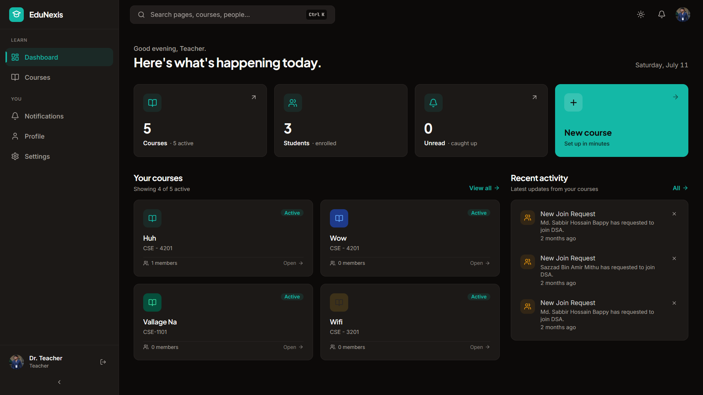
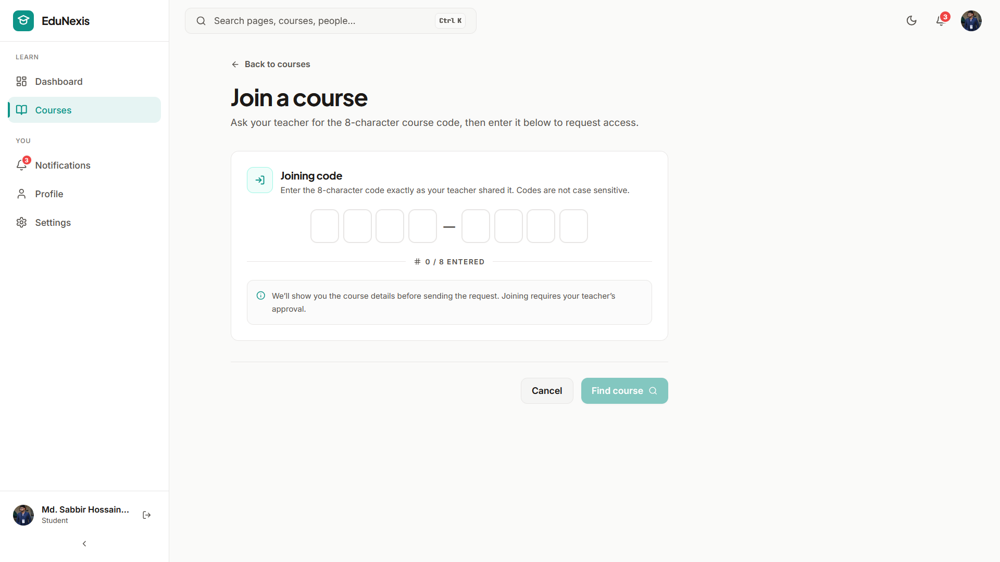
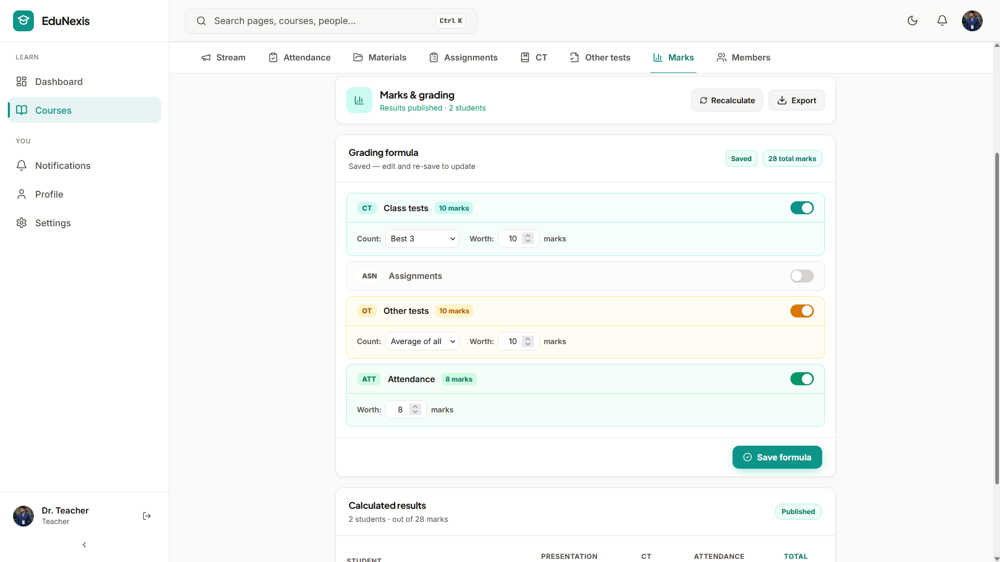
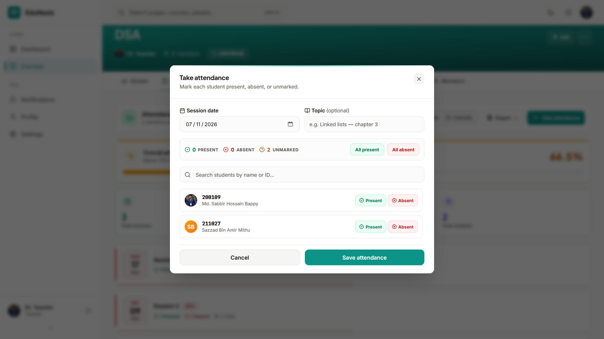

# EduNexis - University Course Management Platform

EduNexis is a production-deployed, modern course management platform built specifically to streamline academic workflows for university students and teachers. Designed for **Jashore University of Science and Technology (JUST)**, it models real-world classroom mechanics—from formula-based grading systems and session attendance registers to secure course entries.

---

## 📸 Screenshots & Previews

### Dashboard & Course Streams


### Course Join Code Flow


### Formula-Based Gradebook


### Attendance Management Sheet


---

## ✨ Features

### 🎓 Academic Management
* **Interactive Course Streams**: Share announcements, attachments, and interact via nested comments.
* **Join Code System**: Students join courses by entering a unique 8-character code with custom input navigation and paste support.
* **Enrollment Management**: Teachers review, approve, or dismiss pending student join requests.

### 📊 Advanced Gradebook System
* **Formula-Based Grading**: Define custom weights for Class Tests (CT), Assignments, Presentations, and Attendance.
* **Flexible Selection Rules**: Calculate final scores based on rules such as **Best 1**, **Best 2**, **Best 3**, or **Average of All** assessments.
* **Automatic Scaling**: Scores are scaled relative to custom weight inputs.
* **Result Publishing**: Draft final marks and publish them to students in one click.

### 📝 Attendance Registers
* **Session Attendance Sheet**: Record attendance for class sessions with quick toggles ("All Present" / "All Absent") and query filtering.
* **Attendance Statistics**: View student attendance percentages with color-coded alerts (Green $\ge 75\%$, Amber $\ge 50\%$, Red $< 50\%$).

### 📤 Multi-Format Exports
* **CSV & PDFs**: Export final gradebooks and attendance reports featuring official university letterhead.
* **Printer Layouts**: Access printer-friendly browser views.

---

## 🛠️ Tech Stack

* **Core Framework**: [React 18](https://react.dev/) + [TypeScript](https://www.typescriptlang.org/)
* **Build Engine**: [Vite](https://vite.dev/)
* **Routing**: [React Router DOM v6](https://reactrouter.com/) (integrated with Guest, Auth, Profile, and Course Enrollment guards)
* **Styling**: [TailwindCSS v3](https://tailwindcss.com/) + [Framer Motion](https://www.framer.com/motion/) (for premium animations and layouts)
* **State Management**:
  * [Zustand](https://zustand.docs.pmnd.rs/) (with local storage persistence for authentication states)
  * [TanStack Query v5](https://tanstack.com/query/latest) (caches and syncs server state)
* **HTTP Client**: [Axios](https://axios-http.com/) (configured with a token-refresh interceptor and a concurrent request queue)
* **Forms**: [React Hook Form](https://react-hook-form.com/) + [Zod](https://zod.dev/) (for schema validations)
* **Export Libraries**: [jsPDF](https://github.com/parallax/jsPDF) + [jspdf-autotable](https://github.com/simonbengtsson/jspdf-autotable) for vector PDFs

---

## 📂 Project Structure

```bash
src/
├── assets/         # Branded logo assets and base icons
├── components/     # Global layout wrappers, route guards, and base UI elements
│   ├── forms/      # Reusable form layouts and sections
│   ├── guards/     # Auth, Guest, Profile, and Enrollment guards
│   ├── layout/     # Sidebars, headers, and footer components
│   └── ui/         # Base UI components (Buttons, Modals, Loaders)
├── config/         # System constants, API routes, and static options
├── features/       # Feature-centric modules
│   ├── announcements/
│   ├── assignments/
│   ├── attendance/ # Session logs, calendars, and stats exports
│   ├── auth/        # Verification screens, logins, and passwords
│   ├── courses/     # Main lists, course details, and join interfaces
│   ├── ct/          # Class Test submissions and marks sheets
│   ├── dashboard/   # Analytics overview charts
│   ├── marks/       # Gradebook formulas, tables, and PDF generators
│   ├── materials/   # Course folders and file previews
│   └── profile/     # Profiles, publications, and education histories
├── hooks/          # Global UI hooks (e.g. debouncers)
├── lib/            # Axios interceptor setup and query clients
├── store/          # Zustand global stores (e.g. authState)
├── types/          # Global TypeScript interfaces
└── utils/          # Formatting helpers and export templates
```

---

## 🚀 Getting Started

### Prerequisites
* **Node.js**: `v18.x` or later
* **Package Manager**: `npm`

### Installation

1. Clone the repository and navigate to the project directory:
   ```bash
   cd edunexis-web
   ```

2. Install dependencies:
   ```bash
   npm install
   ```

3. Configure environment variables. Create a `.env.local` file at the root:
   ```env
   VITE_API_BASE_URL=http://localhost:5041/api
   ```

4. Start the local development server:
   ```bash
   npm run dev
   ```

5. Build the application for production:
   ```bash
   npm run build
   ```

---

## 🌐 Deploying to Vercel

The app is preconfigured for deployment on Vercel using `vercel.json` for SPA URL rewrites:
```json
{
  "rewrites": [
    { "source": "/(.*)", "destination": "/index.html" }
  ]
}
```
Ensure `VITE_API_BASE_URL` points to your production API URL in your Vercel project settings.
