<div align="center">


# EduNexis

**A learning management system built at Jashore University of Science and Technology, for the way universities here actually run.**

Attendance, class tests, assignments, materials, grading formulas and results — one workspace instead of five browser tabs, a group chat and three spreadsheets.

[](https://edunexis.vercel.app)


</div>

---

## Table of contents

- [What EduNexis is](#what-edunexis-is)
- [Why it exists](#why-it-exists)
- [System architecture](#system-architecture)
- [Feature walkthrough](#feature-walkthrough)
  - [1. Public site and faculty directory](#1-public-site-and-faculty-directory)
  - [2. Authentication and university-email gating](#2-authentication-and-university-email-gating)
  - [3. Dashboards](#3-dashboards)
  - [4. Courses, join codes and enrolment approval](#4-courses-join-codes-and-enrolment-approval)
  - [5. Course stream](#5-course-stream)
  - [6. Attendance and the 75% rule](#6-attendance-and-the-75-rule)
  - [7. Course materials](#7-course-materials)
  - [8. Assignments and submissions](#8-assignments-and-submissions)
  - [9. Grading and feedback](#9-grading-and-feedback)
  - [10. Similarity and AI-content analysis](#10-similarity-and-ai-content-analysis)
  - [11. Class tests (CT)](#11-class-tests-ct)
  - [12. Other tests — vivas, presentations, lab tests](#12-other-tests--vivas-presentations-lab-tests)
  - [13. The grading formula and the gradebook](#13-the-grading-formula-and-the-gradebook)
  - [14. Notifications](#14-notifications)
  - [15. Profiles, publications and public pages](#15-profiles-publications-and-public-pages)
  - [16. Exports](#16-exports)
  - [17. Settings, dark mode and command palette](#17-settings-dark-mode-and-command-palette)
  - [18. Administration](#18-administration)
- [Roles and permissions](#roles-and-permissions)
- [Tech stack](#tech-stack)
- [Repository layout](#repository-layout)
- [Running locally](#running-locally)
- [Deployment](#deployment)
- [Credits](#credits)

---

## What EduNexis is

EduNexis is a full-stack learning management system: a **React 18 + TypeScript** single-page front end talking to an **ASP.NET Core 10** REST API built on Clean Architecture and CQRS, backed by **MySQL**, **Redis** and **Cloudinary**.

It covers the whole lifecycle of a university course — creating it, admitting students, running the roll call, publishing materials, collecting and grading work, catching copied submissions, weighting every component into a final result, and publishing that result to students.

| | |
|---|---|
| **Live app** | https://edunexis.vercel.app |
| **Front end** | React 18, TypeScript, Vite, TailwindCSS, TanStack Query, Zustand |
| **Back end** | ASP.NET Core 10 (C# 14), Clean Architecture, CQRS via source-generated Mediator |
| **Database** | MySQL 8 via EF Core (Pomelo), 32 domain entities |
| **Infrastructure** | Redis cache, Cloudinary object storage, JWT auth, Serilog |

---

## Why it exists

Google Classroom was built for a browser tab, not for a three-hour lab and a sixty-name roll call. In a typical department here, one course is spread across a group chat, a shared drive, `marks_final_v4.xlsx`, an inbox of 27 attachments, and a photo of a paper attendance register. One mark goes missing and nobody can prove where.

EduNexis models the mechanics that actually exist in a South Asian university course:

- attendance taken **per session**, with the **75% eligibility rule** tracked live;
- **class tests** where only the *best N of M* count;
- a **weighting formula** per course rather than a fixed grading scheme;
- **vivas, presentations and lab tests** as first-class assessments;
- results **published once**, with each student seeing only their own row.

---

## System architecture

```
┌──────────────────────────────┐         ┌───────────────────────────────────────┐
│  edunexis-web  (Vercel)      │         │  edunexis-api  (Docker / Render)      │
│                              │  HTTPS  │                                       │
│  React 18 + TypeScript       │ ──────► │  EduNexis.API          controllers    │
│  Vite · Tailwind · Framer    │  JWT    │  EduNexis.Application  CQRS handlers  │
│  TanStack Query · Zustand    │ ◄────── │  EduNexis.Domain       entities       │
│  React Hook Form + Zod       │  JSON   │  EduNexis.Infrastructure  EF Core     │
└──────────────────────────────┘         └───────────────┬───────────────────────┘
                                                         │
                                    ┌────────────────────┼────────────────────┐
                                    ▼                    ▼                    ▼
                              ┌──────────┐        ┌────────────┐       ┌────────────┐
                              │  MySQL 8 │        │   Redis    │       │ Cloudinary │
                              │ EF Core  │        │   cache    │       │  files     │
                              └──────────┘        └────────────┘       └────────────┘
```

The API follows Clean Architecture with four projects. Every write that touches a course passes through an `ICourseScopedWrite` contract, so authorisation is enforced centrally rather than re-implemented in each handler.

---

## Feature walkthrough

### 1. Public site and faculty directory

The marketing site is fully public and doubles as a **departmental faculty directory**. The landing page embeds a *working* attendance register — visitors can tap students and watch the counts change before signing up.

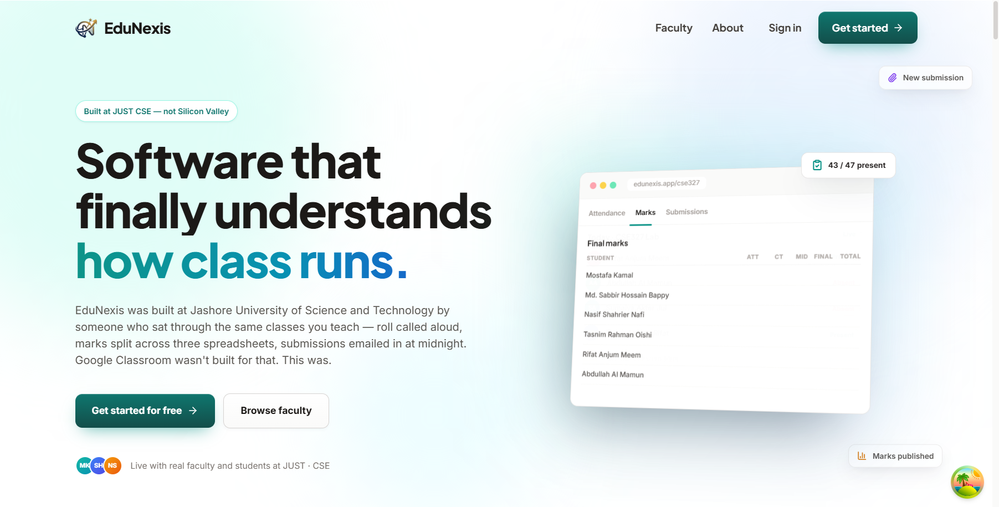

Each teacher who opts in gets a public profile at `/faculty/<slug>` showing designation, biography, research interests, publications and the courses they are running — with course code, semester, **department and academic session**.

<table>
<tr>
<td width="50%">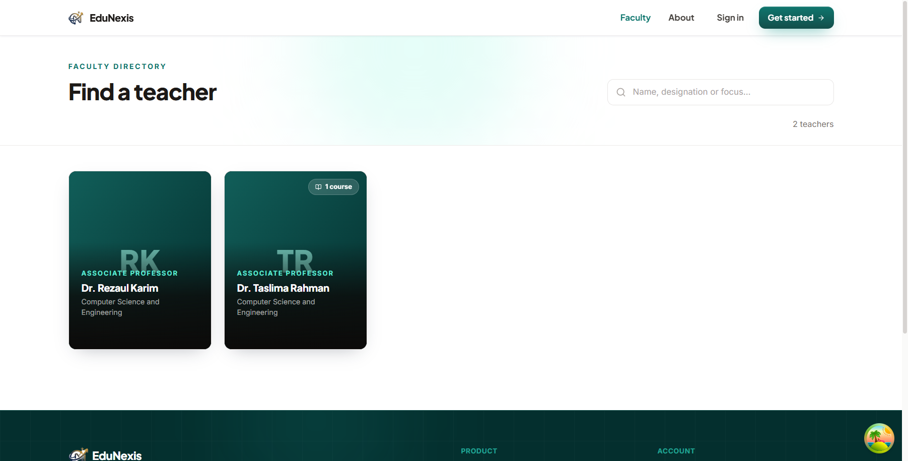</td>
<td width="50%">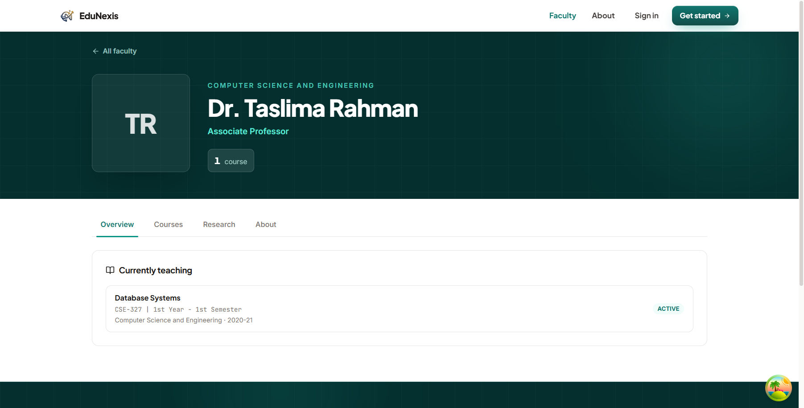</td>
</tr>
<tr>
<td align="center"><em>Directory, filterable by department</em></td>
<td align="center"><em>Public profile with courses taught</em></td>
</tr>
</table>

Courses a teacher has deleted never appear here, and never count toward the "courses taught" figure.

### 2. Authentication and university-email gating

- Registration is restricted to **`@just.edu.bd`** (teachers) and **`@student.just.edu.bd`** (students), so a roster can only ever contain real members of the university. The domain decides the role.
- Sign-up issues a **6-digit OTP** by email; the account cannot be used until it is verified.
- Login returns a **JWT**; the Axios layer holds a refresh interceptor with a concurrent-request queue so a token expiring mid-session does not produce a wall of failures.
- Full **forgot-password / reset-token** flow.
- A **profile-completion guard** routes new users through onboarding before they can reach a course.

### 3. Dashboards

The dashboard is role-aware. Teachers see courses they run, students taught and unread activity; students see enrolled courses, deadlines and results.

<table>
<tr>
<td width="50%">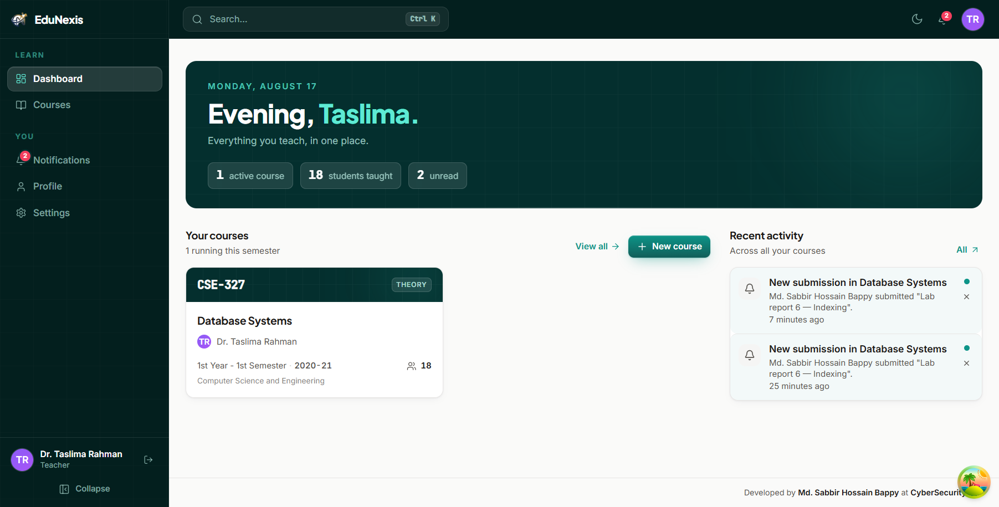</td>
<td width="50%">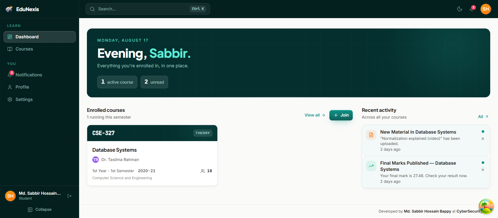</td>
</tr>
<tr>
<td align="center"><em>Teacher — courses and recent activity</em></td>
<td align="center"><em>Student — enrolled courses and activity feed</em></td>
</tr>
</table>

### 4. Courses, join codes and enrolment approval

A course carries a code, title, department, academic session, semester, and type (Theory / Lab). Creating one takes about a minute.

Every course gets an **8-character joining code**. Students enter it, see a confirmation card with the course details before committing, and send a request. **Nobody joins without teacher approval** — requests land in the Members tab and the teacher approves or rejects.

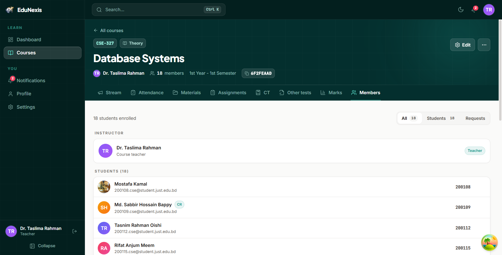

Courses can be **archived** (read-only) or **deleted into a 30-day recycle bin**, from which they can be restored or permanently removed.

### 5. Course stream

The stream is the course's front page: announcements with file attachments, **pinned posts**, and class comments — plus a rail showing what is due next and the most recent materials.

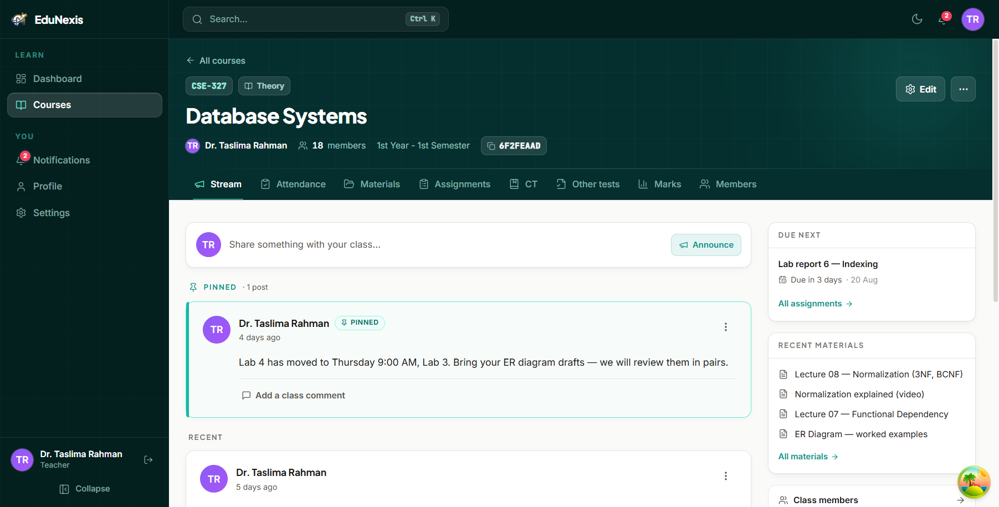

### 6. Attendance and the 75% rule

Attendance is taken per session, with a date and an optional topic. The register offers **Mark all present / all absent**, per-student toggles, a search box for large sections, and a live count of who is still unmarked.

Sessions can be reviewed as a **list** or a **calendar heat map**, with a term-long trend line and the 75% requirement marked.

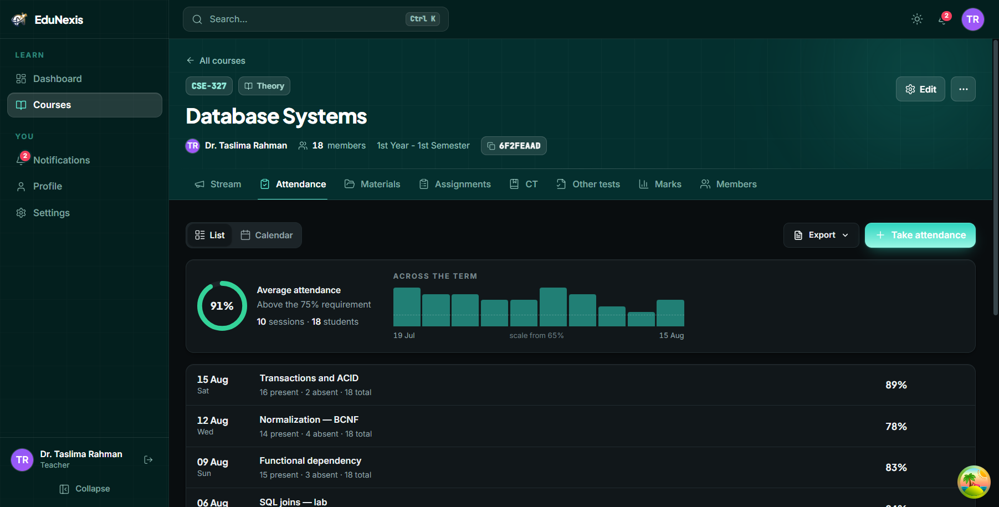

Students see only their own standing — attended sessions, absences, and the percentage that decides exam eligibility, while there is still time to act on it.

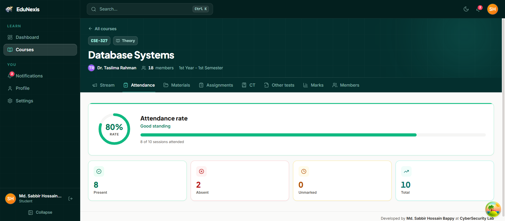

### 7. Course materials

Lecture slides, lab manuals, past questions and reference chapters live on the course page in **real folders**, not a chat log. Links are supported alongside files, and a **YouTube link renders as a playable thumbnail inside the course** so students never leave for a sidebar of recommendations.

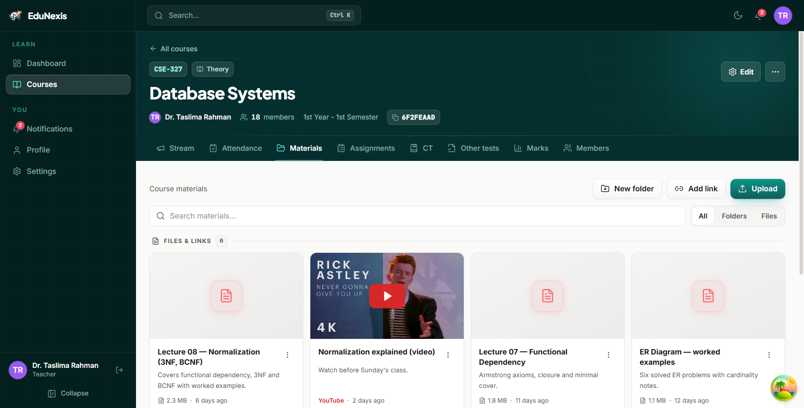

Materials are searchable and filterable by folders/files.

### 8. Assignments and submissions

An assignment carries instructions, a deadline, maximum marks, an optional reference file, and a **late-submission policy**. The list groups work into *Needs your attention*, *Active*, *Fully graded* and *Closed* for teachers, and *Due soon*, *Action needed*, *Graded* and *Missed* for students.

Submissions are **multi-part, in the Google Classroom sense**: a student turns in any combination of **files, links and a written answer** in one submission.

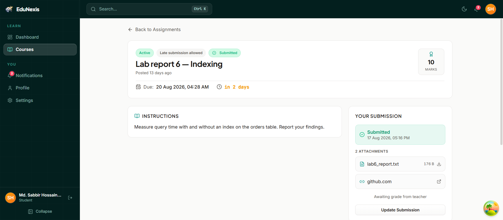

Updating a submission shows everything **already turned in**, each item removable on its own, with new files and links added alongside. Nothing a student does not explicitly remove is ever deleted.

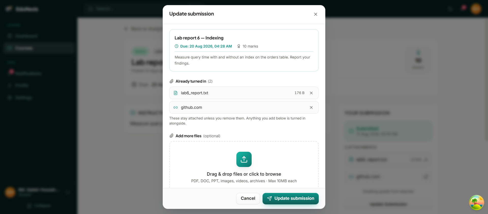

Late submissions are flagged automatically, and the teacher sees at a glance who has not submitted.

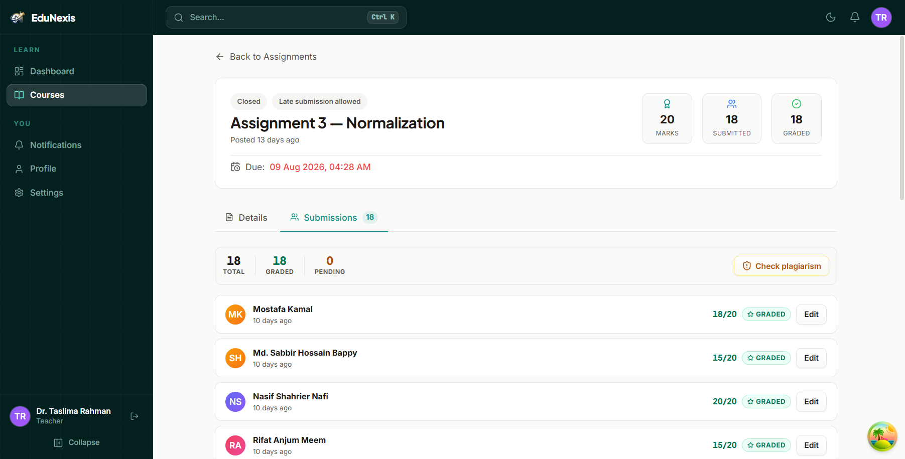

### 9. Grading and feedback

Marks are entered against the assignment's maximum with a live percentage bar, and **written feedback stays attached to the submitted work** rather than living in a reply email. Students are notified the moment their work is marked.

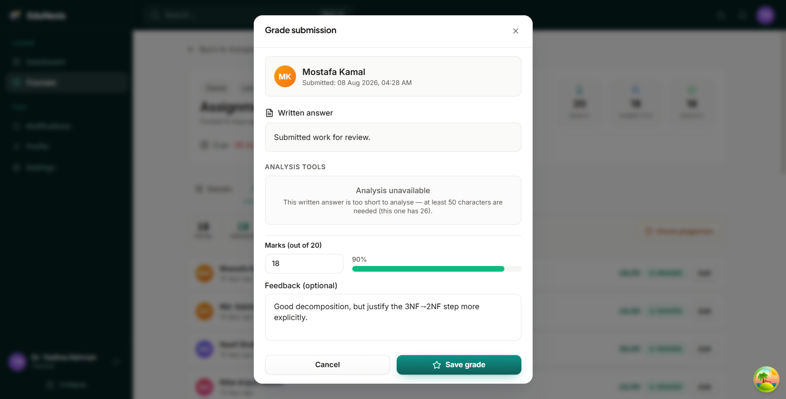

### 10. Similarity and AI-content analysis

Two independent checks:

- **Cross-submission similarity** — one click compares every submission in the assignment against every other. Text answers are used directly; PDFs are parsed client-side with `pdfjs-dist` and their text extracted. Pairs are scored with **Jaccard bigram similarity** and banded (0–29% low, 30–59% review recommended, 60–100% likely plagiarised), with the overlapping passages shown. Anything that could not be compared is listed with the reason.
- **Per-submission analysis** — AI-generated-content detection and web-plagiarism lookup for written answers.

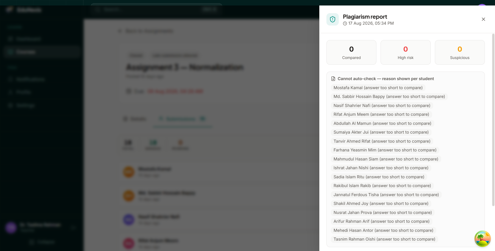

### 11. Class tests (CT)

Class tests are modelled the way departments actually run them. A CT has a date held and total marks, and can be kept as a **draft** until results are ready, then **published** — at which point students can see their own mark.

Teachers upload the **best, worst and average answer scripts**, so students see not just their number but what full marks looked like.

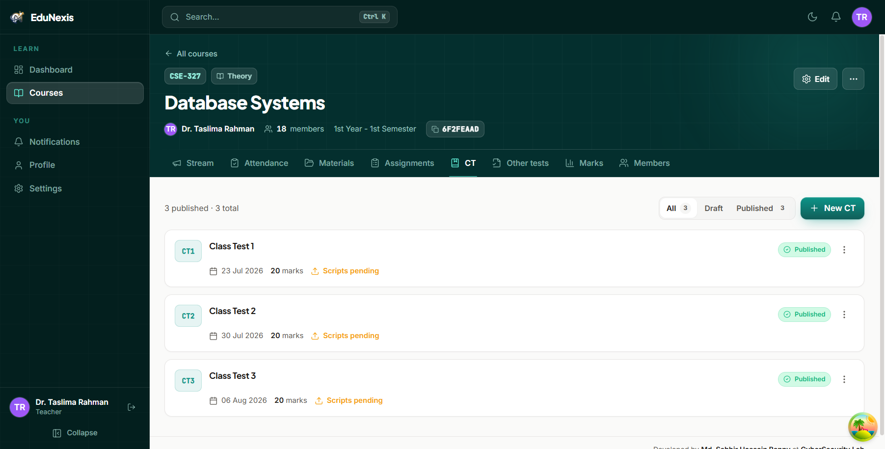

### 12. Other tests — vivas, presentations, lab tests

Anything that is not a CT or an assignment: oral tests, vivas, lab tests, presentations, pop quizzes. Same draft/publish lifecycle, same per-student marking, and they fold into the final result through the same weighting formula.

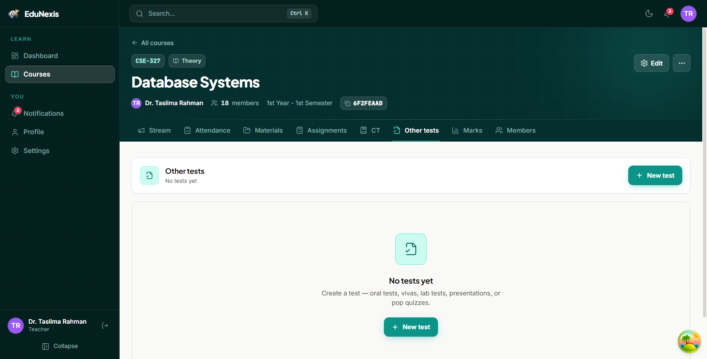

### 13. The grading formula and the gradebook

This is the core of the system. Rather than a fixed scheme, each course defines **its own formula**:

- pick which components count — class tests, assignments, other tests, attendance;
- for class tests and assignments choose **Best 1 / Best 2 / Best 3 / Average of all**, so a dropped test does not sink a student;
- give each component a **mark weight**, shown live as a percentage of the total;
- toggle any component off entirely.

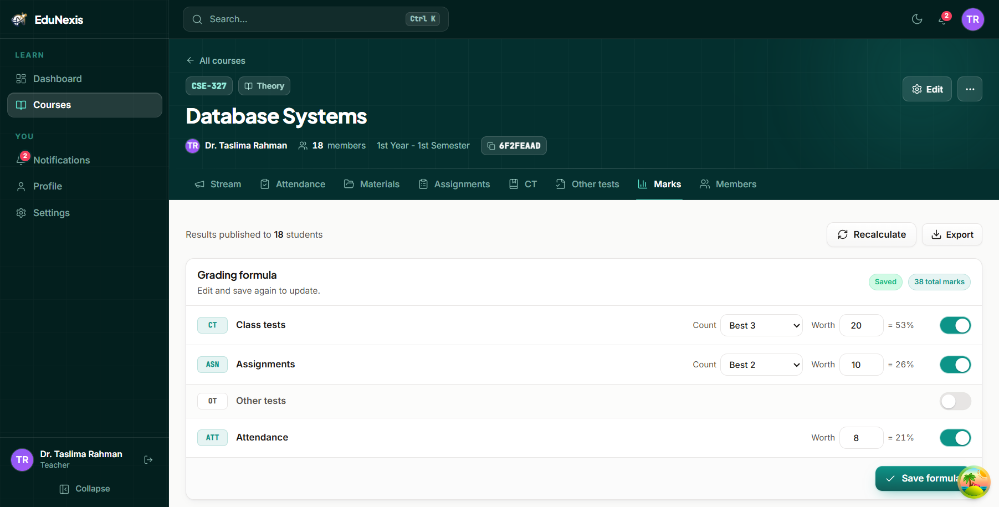

Totals recalculate for the whole section on demand — no spreadsheet formulas to copy down. The gradebook shows every component per student alongside a **spread-of-the-class histogram**.

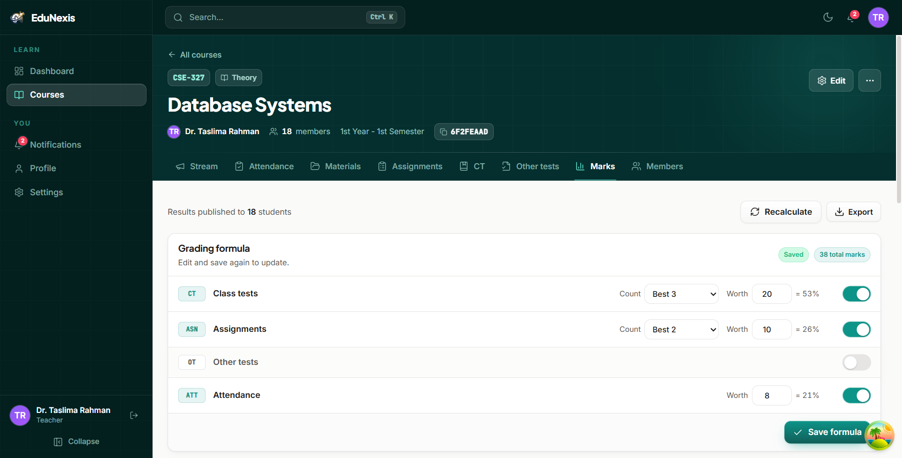

Results are **published once**, and each student sees only their own row, with the arithmetic shown.

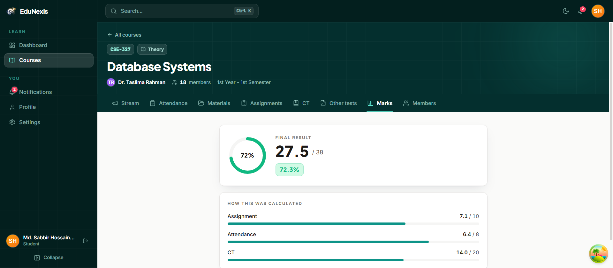

### 14. Notifications

Announcements, new assignments, new submissions, published marks and approved join requests all raise in-app notifications, delivered live while the page is open. They can be filtered by category, marked read individually or all at once, and deleted.

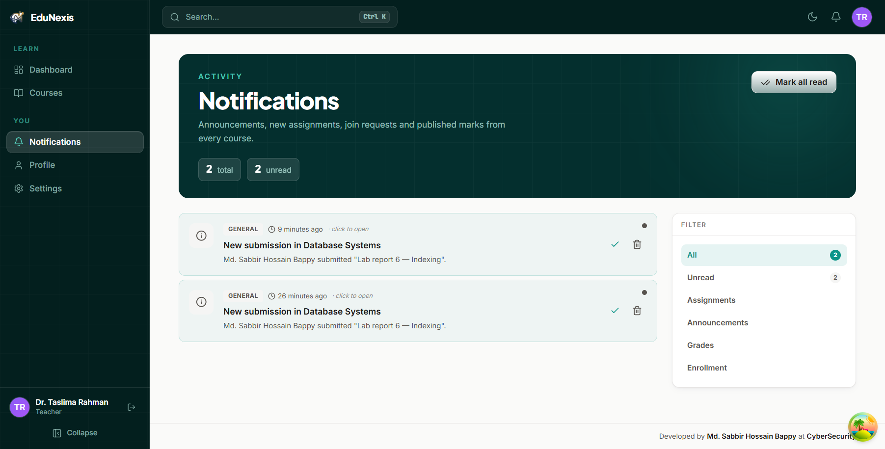

The domain also carries `NotificationPreference` and an SMS service alongside email, so delivery channels are configurable per user.

### 15. Profiles, publications and public pages

Every user has a profile with photo, cover, department, designation and contact details. Teachers additionally get **research interests, fields of work, office location and hours, education history and a publication list**.

Contact details are deliberately relationship-scoped: a viewer sees them only when they are the profile owner or share an active course. Teachers can opt into a **public profile with a custom slug**, which is what the faculty directory links to.

### 16. Exports

The paperwork still has to be handed in on paper. Attendance registers and the full gradebook export to **PDF** (vector, via jsPDF + autotable, with university letterhead) and **CSV**, plus printer-friendly views.

### 17. Settings, dark mode and command palette

- Every screen is built in **both light and dark** — not dimmed as an afterthought, because much of this work happens late at night.
- A **command palette** (`Ctrl` + `K`) jumps between courses and sections.
- The whole bundle is deliberately light so it opens quickly on campus wifi and on mobile data, and the layout is responsive down to a phone.

### 18. Administration

A `SuperAdmin` / `DepartmentAdmin` area covers platform settings, **teacher course quotas** with a grant ledger, and an audit log.

---

## Roles and permissions

| Capability | Student | Teacher | Dept. admin | Super admin |
|---|:---:|:---:|:---:|:---:|
| Join a course with a code | ● | | | |
| Submit and update work | ● | | | |
| See own marks and attendance | ● | | | |
| Create and edit courses | | ● | ● | ● |
| Approve or reject join requests | | ● | ● | ● |
| Take attendance | | ● | ● | ● |
| Post materials and announcements | | ● | ● | ● |
| Grade work and publish results | | ● | ● | ● |
| Run similarity checks | | ● | ● | ● |
| Platform settings and quotas | | | ● | ● |

Course-scoped writes are authorised centrally, so a teacher can only ever act on courses they own.

---

## Tech stack

### Front end — `edunexis-web`

| Concern | Choice |
|---|---|
| Framework | React 18 + TypeScript 5.7 |
| Build | Vite 6 |
| Routing | React Router v6 with guest / auth / profile / enrolment guards |
| Styling | TailwindCSS 3 + Framer Motion |
| Server state | TanStack Query v5 |
| Client state | Zustand (persisted auth) |
| HTTP | Axios with token-refresh interceptor + request queue |
| Forms | React Hook Form + Zod |
| PDF / files | jsPDF, jspdf-autotable, html2pdf, pdfjs-dist |
| Charts | Recharts |

### Back end — `edunexis-api`

| Concern | Choice |
|---|---|
| Runtime | ASP.NET Core 10 (C# 14) |
| Architecture | Clean Architecture — Domain / Application / Infrastructure / API |
| Pattern | CQRS via source-generated Mediator, with logging + validation pipeline behaviours |
| Data | EF Core with Pomelo MySQL, repository + unit of work, 32 entities |
| Validation | FluentValidation |
| Mapping | Mapster |
| Cache | Redis (StackExchange.Redis) |
| Auth | JWT bearer + BCrypt hashing, OTP email verification |
| Storage | Cloudinary |
| Email / SMS | FluentEmail (SMTP) and an SMS channel |
| Logging | Serilog — console + rolling files |

**15 REST controllers**: Admin, Analysis, Announcements, Assignments, Attendance, Auth, CT, Courses, Marks, Materials, Notifications, Presentations, Profile, Public.

---

## Repository layout

EduNexis is two repositories.

<details>
<summary><strong><code>edunexis-web</code> — React front end</strong></summary>

```
src/
├── components/          # guards, layout, shared UI primitives
│   ├── forms/  guards/  layout/  ui/
├── config/              # constants, route tables, static options
├── features/            # one folder per domain area
│   ├── admin/           # platform settings, quotas
│   ├── announcements/   # stream posts, pinning, comments
│   ├── assignments/     # assignments, submissions, grading, similarity
│   ├── attendance/      # registers, calendar, stats, exports
│   ├── auth/            # login, register, OTP, password reset
│   ├── courses/         # list, detail, create/edit, join flow, members
│   ├── ct/              # class tests and answer scripts
│   ├── dashboard/       # role-aware overview
│   ├── marks/           # formula builder, gradebook, publishing
│   ├── materials/       # files, folders, links, video embeds
│   ├── notifications/   # feed, filters, badge
│   ├── presentations/   # vivas, presentations, other tests
│   ├── profile/         # profiles, publications, education
│   ├── public/          # landing, faculty directory, about
│   └── settings/        # preferences
├── hooks/  lib/  store/  types/  utils/
└── docs/screenshots/    # images used by this README
```
</details>

<details>
<summary><strong><code>edunexis-api</code> — ASP.NET Core back end</strong></summary>

```
src/
├── EduNexis.Domain/          # entities, enums, domain events, interfaces
├── EduNexis.Application/     # CQRS features, DTOs, validators, behaviours
│   └── Features/             # Admin, Announcements, Assignments, Attendance,
│                             # Auth, CT, Courses, Marks, Materials,
│                             # Notifications, Presentations, Profile, Public
├── EduNexis.Infrastructure/  # EF Core, repositories, migrations, services
│   └── Services/             # Auth, Cache, Email, Notification,
│                             # Plagiarism, Sms, Storage
└── EduNexis.API/             # controllers, middleware, filters, hubs
tests/
└── EduNexis.UnitTests/
```
</details>

---

## Running locally

### Prerequisites

- Node.js 18+
- .NET SDK 10
- MySQL 8
- Redis (optional — caching only)

### Back end

```bash
cd edunexis-api

# configure src/EduNexis.API/appsettings.json:
#   ConnectionStrings:DefaultConnection, Jwt, Cloudinary, Smtp

dotnet restore EduNexis.slnx
dotnet ef database update \
  --project src/EduNexis.Infrastructure \
  --startup-project src/EduNexis.API
dotnet run --project src/EduNexis.API      # http://localhost:5041
```

### Front end

```bash
cd edunexis-web
npm install

# .env.local
echo "VITE_API_BASE_URL=http://localhost:5041/api" > .env.local

npm run dev                                 # http://localhost:5173
```

### Other commands

```bash
npm run build      # production bundle
npm run lint       # eslint
dotnet test        # API unit tests
```

---

## Deployment

**Front end — Vercel.** `vercel.json` rewrites all paths to `index.html` for SPA routing. Set `VITE_API_BASE_URL` to the production API in the Vercel project settings.

```json
{ "rewrites": [{ "source": "/(.*)", "destination": "/index.html" }] }
```

**Back end — Docker.** A multi-stage `Dockerfile` sits in the API root.

```bash
docker build -t edunexis-api .
docker run -d -p 5041:8080 --name edunexis-backend edunexis-api
```

> **Note on managed MySQL free tiers.** Some free tiers cap concurrent connections (Clever Cloud allows 5). `Database:RunMigrationsOnStartup` is therefore `false` by default — migrating on every container restart exhausts the pool and breaks simultaneous deployments. Apply schema changes in production from the generated `migration.sql`.

---

## Credits

Built and maintained by **[Md. Sabbir Hossain Bappy](https://www.linkedin.com/in/snbappy/)** at the **[CyberSecurity Lab](https://nowsin.me/)**, Department of Computer Science and Engineering, Jashore University of Science and Technology.

Free for departments — no licence fees, no procurement process.
